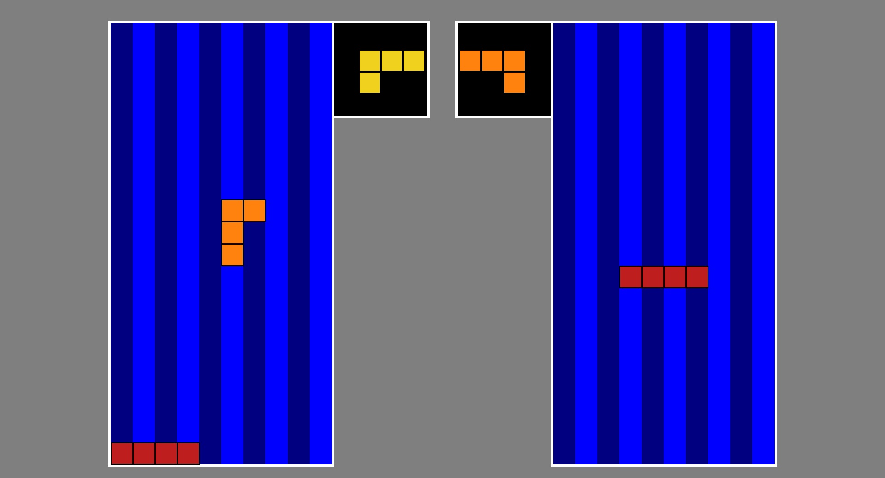

# Python-LAN-Tetris

This is a reproduction of Tetris but in multiplayer.
## Features
- Possibility to change lines settings
## Installation
1. Download the repository by clicking on `Code > Download ZIP`
2. Extract the ZIP file
3. Run `main.pyw`
## Requirements
- Python 3.7
- Python pygame library
- Python time library
- Python random library